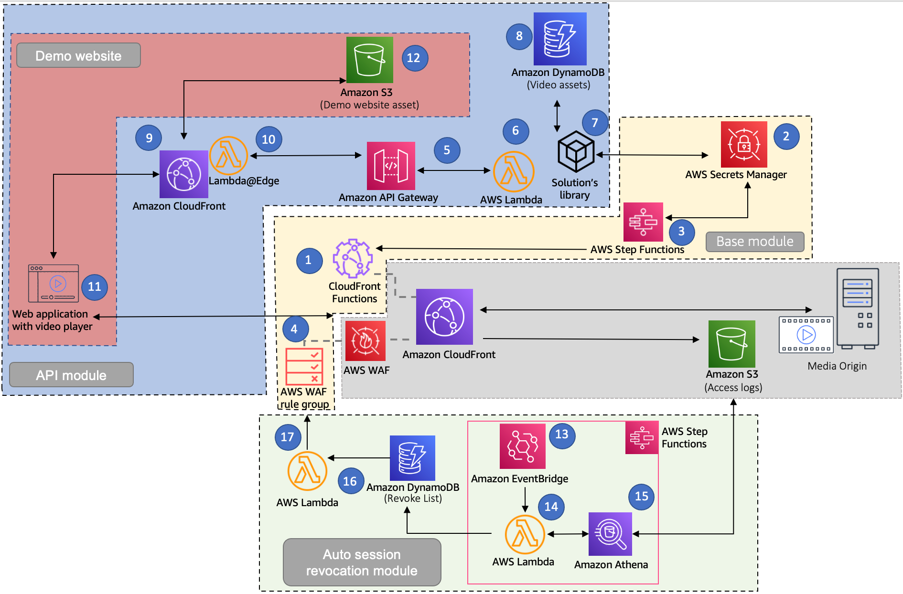
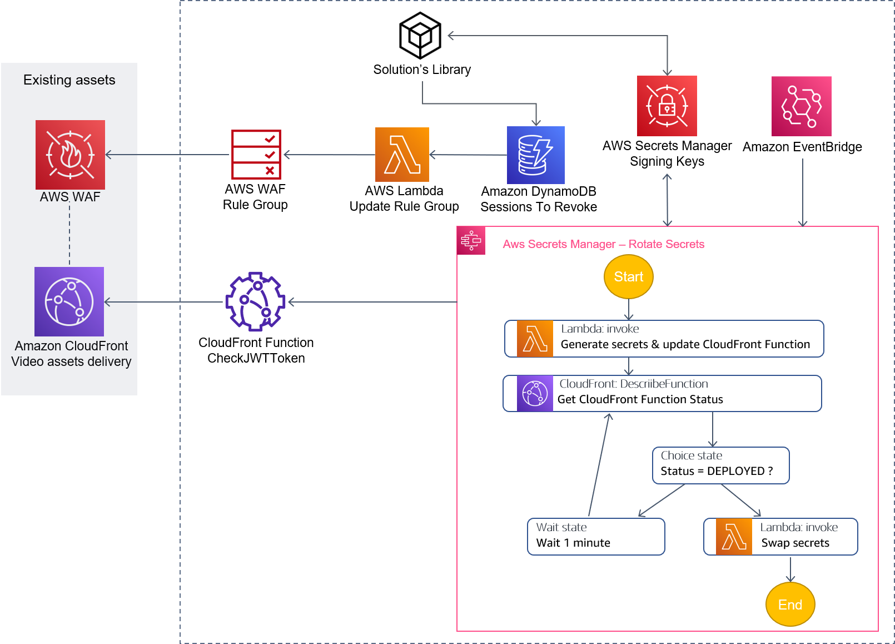
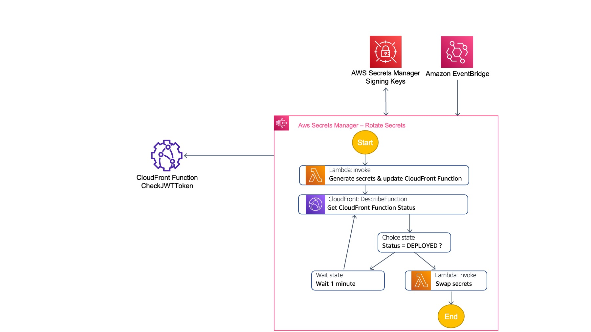
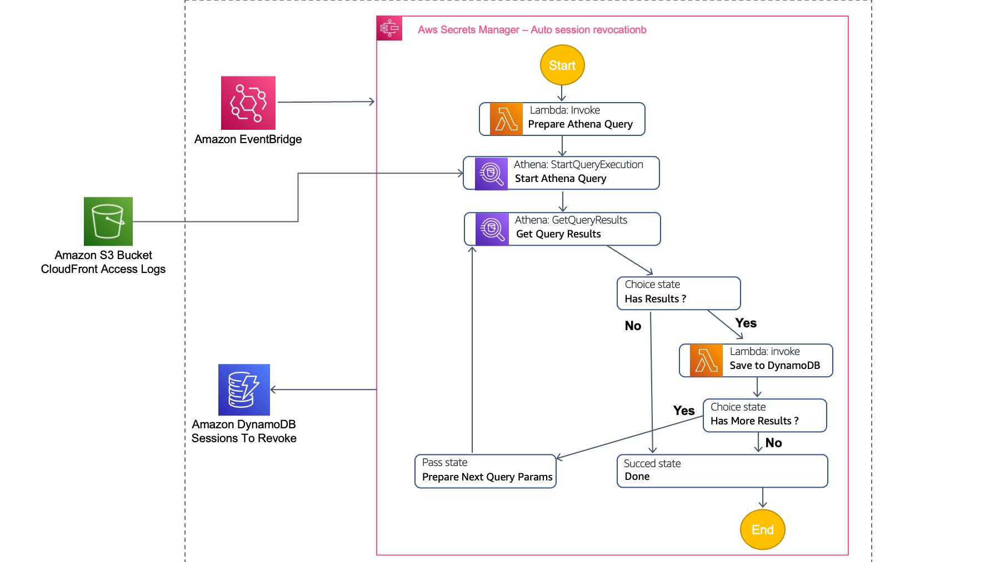

# Secure Media Delivery at the Edge on AWS

The Secure Media Delivery at the Edge solution protects your premium video content delivered through Amazon CloudFront from unauthorized access. The solution offers an additional layer of security based on individual access tokens added to the delivery URL. Existing or new CloudFront configurations used for Live Streaming and VOD workloads can benefit from this solution, whereby streaming operations engineers can control access to video assets by issuing individual tokens for each authorized viewer, verified at the Edge by CloudFront Functions.

## On this Page
- [Secure Media Delivery at the Edge](#secure-media-delivery-at-the-edge)
  - [On this Page](#on-this-page)
  - [Architecture Overview](#architecture-overview)
  - [Deployment](#deployment)
  - [WorkFlow Overview](#workflow-overview)
    - [Base module:](#base-module)
    - [API Module:](#api-module)
    - [Auto session revocation module](#auto-session-revocation-module)
  - [Solution components](#solution-components)
    - [Base Module](#base-module-1)
    - [Key Rotation workflow](#key-rotation-workflow)
    - [API Module](#api-module-1)
    - [Auto session revocation module](#auto-session-revocation-module-1)
  - [Creating a custom build](#creating-a-custom-build)
    - [Prerequisites:](#prerequisites)
    - [Options 1: Deploying through the CDK.](#options-1-deploying-through-the-cdk)
      - [1. Clone the repo.](#1-clone-the-repo)
      - [2. Install the dependencies of the project to make it ready to use. To do so, simply run the below command.](#2-install-the-dependencies-of-the-project-to-make-it-ready-to-use-to-do-so-simply-run-the-below-command)
      - [3. Run the built-in wizard which will prompt you with questions about the modules to deploy](#3-run-the-built-in-wizard-which-will-prompt-you-with-questions-about-the-modules-to-deploy)
      - [4. Ensure that the AWS CDK has been bootsrapped on the target account, this is typically the case if you have never used AWS CDK before on the account.](#4-ensure-that-the-aws-cdk-has-been-bootsrapped-on-the-target-account-this-is-typically-the-case-if-you-have-never-used-aws-cdk-before-on-the-account)
      - [5. Deploy the solution using the following command.](#5-deploy-the-solution-using-the-following-command)
    - [Option 2: Generate a CloudFormation template.](#option-2-generate-a-cloudformation-template)
      - [1. Clone the repo](#1-clone-the-repo-1)
      - [2. Running unit tests for customization](#2-running-unit-tests-for-customization)
      - [3. Create an Amazon S3 Bucket](#3-create-an-amazon-s3-bucket)
      - [4. Create the deployment packages](#4-create-the-deployment-packages)
      - [5. Launch the CloudFormation template.](#5-launch-the-cloudformation-template)
  - [License](#license)
  - [Information](#information)
  - [Requirements](#requirements)

## Architecture Overview

<div align="center">
  
  <div align="center"><sub>Secure media stream delivery (click to enlarge)</sub></div>
</div>

Deploying Secure Media Delivery solution in your environment will produce following infrastructure. 


## Deployment

The solution is deployed using a CloudFormation template. For details on deploying the solution please see the details on the solution home page: [Secure Media Delivery at the Edge](https://aws.amazon.com/solutions/implementations/secure-media-delivery-at-the-edge/)

## WorkFlow Overview 

Customers can deploy the solution to protect their video stream from unauthorized access by adding a cookie-less tokenization embedded in the URL path.

The solution can be deployed though CDK or by using a pre generated CloudFormation template.
With CDK, you can selectively choose which modules and elements should be deployed for each new stack you create:
  - Base module (always deployed)
  - API module (optional)
  - Demo website (optional)
  - Auto session revocation (optional)

HTML guide [here](https://docs.aws.amazon.com/solutions/latest/secure-media-delivery-at-the-edge/welcome.html)
PDF guide [here](https://docs.aws.amazon.com/solutions/latest/secure-media-delivery-at-the-edge/secure-media-delivery-at-the-edge.pdf)

### Base module:
1.	An Amazon CloudFront Function that validates secure tokens, permitting or denying access to video content
2.	An AWS Secrets Manager stored secrets holding signing keys for generating and validating viewers’ tokens
3.	An AWS Step Functions workflow that coordinates key rotation process
4.	An AWS WAF Rule Group containing the list of playback sessions that should be blocked as they get identified as compromised
5.	An Amazon API Gateway public API used to process the requests to generate the tokens for video playback and to manually revoke specified playback sessions
6.	An AWS Lambda Function associated with API Gateway that generate the token for video playback based on the retrieved metadata about the video assets and token parameters
7.	Solution provided library, providing the necessary methods to generate the tokens, imported in the AWS Lambda Function

### API Module:

8.	An Amazon DynamoDB table storing metadata about video assets and corresponding parameters used to generate the tokens
9.	An Amazon CloudFront distribution delivering the traffic from API Gateway and deliver demo website when enabled
10.	Lambda@Edge function which signs outgoing requests towards API Gateway according to SigV4 specification
11.	Demo website (when enabled) with video player embedded in it
12.	Amazon S3 bucket storing static assets for demo website

### Auto session revocation module

13.	An Amazon EventBridge rule that runs periodically to invoke session revocation workflow in AWS Step Functions
14.	Lambda functions invoked in Step Functions workflow that produce SQL query submitted to Amazon Athena, then to obtain the results from Athena and push move them forward in the processing pipeline
15.	Amazon Athena executing SQL queries against CloudFront access logs to list the suspicious video playback session ids with abnormal traffic characteristics
16.	 An Amazon DynamoDB table revocation list storing session ids that have been submitted to be revoked with additional information
17.	Lambda function which compiles a final list of the playback sessions marked to be blocked and updates AWS WAF Rule Group with the appropriate rules matching selected sessions

## Solution components

### Base Module

<div align="center">
  
  <div align="center"><sub>Secure media stream delivery (click to enlarge)</sub></div>
</div>

Base module includes the solution components which are core and central to the solution, while rest of the modules expands on it.

### Key Rotation workflow

<div align="center">
  
  <div align="center"><sub>Secure media stream delivery (click to enlarge)</sub></div>
</div>

This pipeline is initiated first time after the base module stack is deployed and after that periodically according to the key rotation setting specified when launching the solution. The configuration on when the key rotation process should be initiated is saved as EventBridge rule. Any time that workflow is initiated, the subsequent steps are controlled via AWS Step Functions workflow with the steps as depicted above.

### API Module

<div align="center">
  
  <div align="center"><sub>Secure media stream delivery (click to enlarge)</sub></div>
</div>

API Module is made available in the solution to represent an example of how to integrate token management process into playback API section of customer architecture. The central element of this module is API Gateway with two Lambda integrations responsible for performing token related operations, namely generate the token and revoke given session it. 

### Auto session revocation module

<div align="center">
  
  <div align="center"><sub>Secure media stream delivery (click to enlarge)</sub></div>
</div>

Auto session revocation module design leverages AWS Step Functions to coordinate this entire multi step process. Predefined workflow is invoked periodically as specified in the created EventBridge rule – for ongoing video delivery streaming it is reasonable to set that periodicity at the range of few minutes to reduce the time it takes to detect and block the suspicious sessions. 

Note that before using auto revocation module, collection of access logs to S3 must be configured for each CloudFront distribution, the traffic of which should be analyzed through this process. It is also required to set up a database and a table in Athena referencing access logs in the S3 bucket.

## Creating a custom build

Before getting started, verify that your configuration matches the [list of requirements](#-requirements). 
### Prerequisites:
* [AWS Command Line Interface](https://aws.amazon.com/cli/)
* Node.js 12.x or later
* AWS CDK 2.24.1

The are 2 options for deploying the solution: using the CDK deployment tools or running the build script to generate a CFN template and the packaged lambda code.

### Options 1: Deploying through the CDK.
This options simply flollows the standard CDK deployment process. You will need to run `cdk bootstrap` before you run cdk deploy the first time to setup the cdk resource in your AWS account. Details on using the CDK can be found [here].

#### 1. Clone the repo.


#### 2. Install the dependencies of the project to make it ready to use. To do so, simply run the below command.

On Linux

  ```bash
  cd source
  ./install_dependencies.sh
  ```
On Windows
  
  ```bash
  cd source
  ./install_dependencies.ps1
  ```


#### 3. Run the built-in wizard which will prompt you with questions about the modules to deploy


  ```bash
  npm run wizard
  ```

The wizard will then generate a configuration in the `solution.context.json` file that is at the root of this repository. 


#### 4. Ensure that the AWS CDK has been bootsrapped on the target account, this is typically the case if you have never used AWS CDK before on the account.

```bash
npx cdk bootstrap
```

  > You only need to bootstrap the target account once, you can then dismiss this step. If you're planning on using multiple regions, the bootstrap process must be done for each AWS region.

#### 5. Deploy the solution using the following command.

```bash
npx cdk deploy --all
```


### Option 2: Generate a CloudFormation template.
The CloudFormation template (generated by the CDK) includes a lambda backed custom resource to configure MediaLive and create a UUID. To launch the solution the Lambda source code has to be deployed to an Amazon S3 bucket in the region you intend to deploy the solution. 

#### 1. Clone the repo
Download or clone the repo and make the required changes to the source code.

#### 2. Running unit tests for customization
Run unit tests to make sure added customization passes the tests:
```
cd ./deployment
chmod +x ./run-unit-tests.sh && ./run-unit-tests.sh
```

#### 3. Create an Amazon S3 Bucket
The CloudFormation template is configured to pull the Lambda deployment packages from Amazon S3 bucket in the region the template is being launched in. Create a bucket in the desired region with the region name appended to the name of the bucket. eg: for us-east-1 create a bucket named: `my-bucket-us-east-1`
```
aws s3 mb s3://my-bucket-us-east-1
```

Ensure that you are owner of the AWS S3 bucket. 
```
aws s3api head-bucket --bucket my-bucket-us-east-1 --expected-bucket-owner YOUR-AWS-ACCOUNT-NUMBER
```

#### 4. Create the deployment packages
Build the distributable:
```
chmod +x ./build-s3-dist.sh
./build-s3-dist.sh <my-bucket> secure-media-delivery-at-the-edge <version>
```

> **Notes**: The _build-s3-dist_ script expects the bucket name as one of its parameters. This value should not have the region suffix (remove the -us-east-1)

Deploy the distributable to the Amazon S3 bucket in your account:
```
aws s3 sync ./regional-s3-assets/ s3://my-bucket-us-east-1/secure-media-delivery-at-the-edge/<version>/ 
aws s3 sync ./global-s3-assets/ s3://my-bucket-us-east-1/secure-media-delivery-at-the-edge/<version>/ 
```

#### 5. Launch the CloudFormation template.
* Get the link of the VIDEOSTREAM.template uploaded to your Amazon S3 bucket.
* Deploy the solution.


## License

* This project is licensed under the terms of the Apache 2.0 license. See here `LICENSE`.

This solution collects anonymous operational metrics to help AWS improve the
quality of features of the solution. For more information, including how to disable
this capability, please see the [implementation guide](https://docs.aws.amazon.com/solutions/latest/live-streaming/welcome.html).

## Information

The below information displays approximate values associated with deploying and using this stack.

Metric | Value
------ | ------
**Deployment Time** | 5-10 minutes (depending on the selected options)
**CDK Version** | 2.24.1

## Requirements

- An AWS Account ([How to create an AWS account](https://aws.amazon.com/premiumsupport/knowledge-center/create-and-activate-aws-account/?nc1=h_ls) | [How to create an AWS Organization account](https://docs.aws.amazon.com/organizations/latest/userguide/orgs_manage_accounts_create.html))
- [Node JS 12+](https://nodejs.org/en/) must be installed on the deployment machine. ([Instructions](https://nodejs.org/en/download/))
- The [AWS CDK 2.24.1](https://aws.amazon.com/en/cdk/) must be installed on the deployment machine. ([Instructions](https://docs.aws.amazon.com/cdk/latest/guide/getting_started.html))


